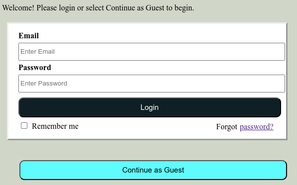
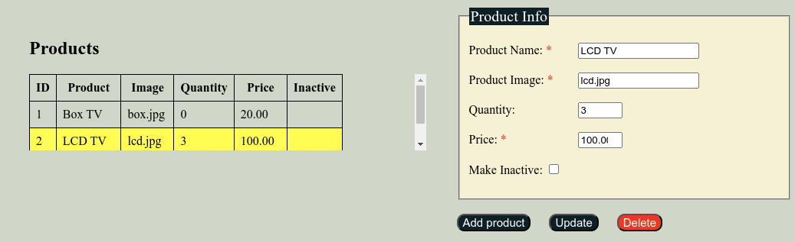
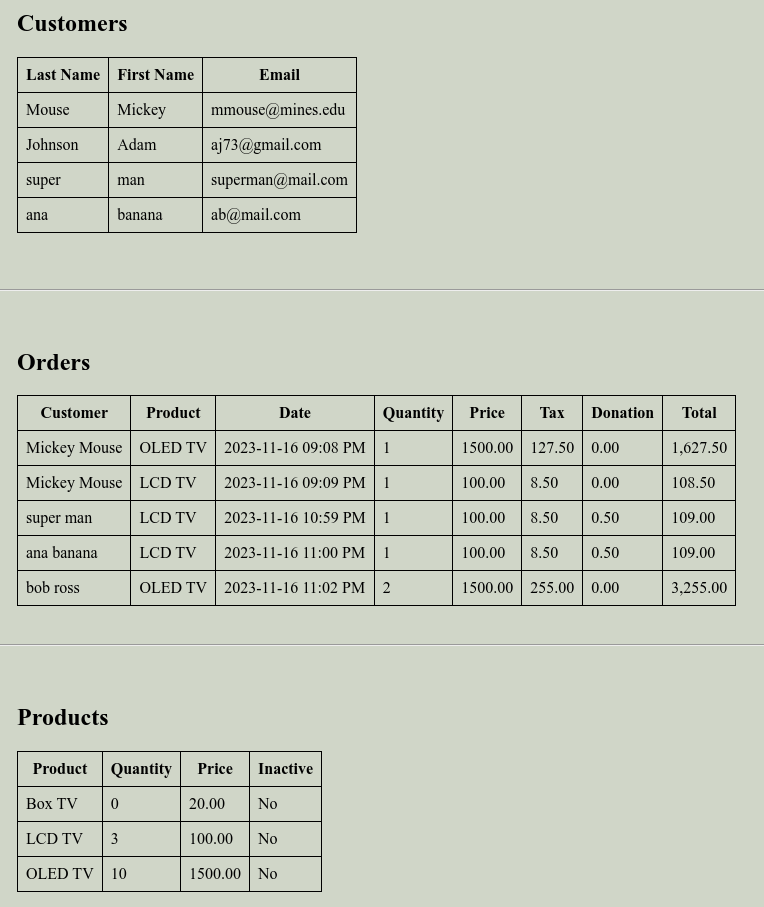

This is a mock store page created using the LAMP stack. Other technologies used include CSS, Javascript, jQuery and Ajax.

It includes a customer mode and an admin mode where the database can be viewed and edited.

